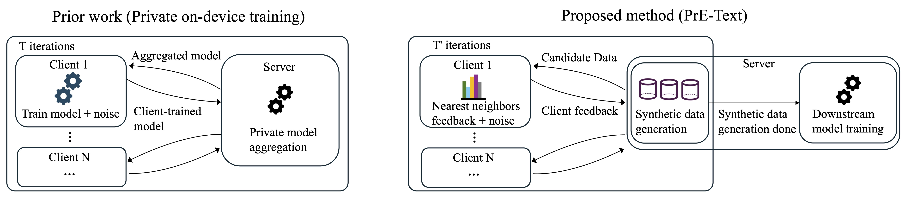
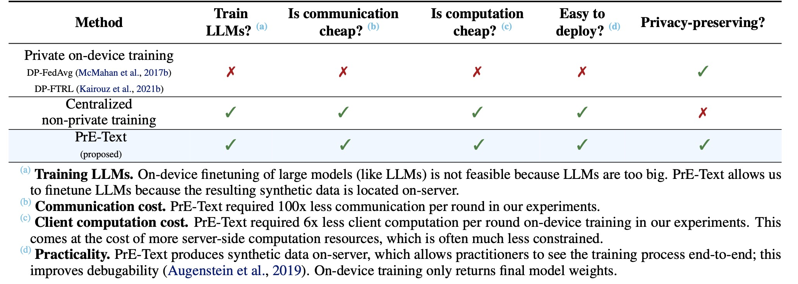

<h1 align="center"> PrE-Text: Training Language Models on Private Federated Data in the Age of LLMs</h1>

This repository provides code and instructions for reproducing the experiments of PrE-Text: Training Language Models on Private Federated Data in the Age of LLMs. It implements the PrE-Text algorithm, which allows us to finetune language models to better predict private federated text without training on-device.

<p align="center">
  
</p>

PrE-Text provides advantages over on-device training, including (1) much better communication/client computation cost, (2) ease of deployment, and (3) the ability to privately finetune large models that cannot fit on-device (such as LLMs). It is able to provide these advantages while outperforming on-device baselines (such as DP-FedAvg and DP-FTRL) on next token prediction in our experiments at practical privacy levels of $\epsilon=1.29$, $\epsilon=7.58$.

<p align="center">
  
</p>


# Environment setup
We use conda/pip to setup our environment.
```
$ git clone https://github.com/houcharlie/PrE-Text.git
$ cd PrE-Text
$ conda create -n pretext python=3.10 -y
$ conda activate pretext
$ pip install -r requirements.txt
```

# Datasets
To run PrE-Text on your own dataset, first create a file called `initialization.json` which contains at least 10000 samples you want to use as your initial population of samples ($S_1$ in the paper). Then create a `[dataset_name]_train.json` and `[dataset_name]_eval.json` where `[dataset_name]_train.json` should be a list of private samples and `[dataset_name]_eval.json` should be a list of samples keyed by "1", e.g. `{"1": [list of samples]}`. `[dataset_name]_train.json` represents the dataset of all federated users combined. Note that we kept the maximum number of samples in each client to be below 16 in the paper for PrE-Text--the amount of noise added to ensure privacy is proportional to this number. If your upper bound for the number of samples per client is too large (greater than 16), please subsample the samples at each client before gathering them together into `[dataset_name]_train.json`.

Put everything under the `data` folder.


# Running PrE-Text
PrE-Text broadly consists of two stages: (1) the first stage creates a small set of differentially private (DP) synthetic data at the server (which we call DP seed data), and (2) the second stage bootstraps more samples from the DP seed data to create a large DP synthetic dataset once again at the server. Note that all the privacy loss is incurred in stage 1, and no additional privacy is leaked in stage 2 because of the post-processing property of DP. 

You need to set (1) results to be stored, (2) where the downloaded models from huggingface will be, (3) the name of your dataset, (4) the maximum number of samples in each client, (5) the ratio of the noise to the sensitivity, and (6) the $\delta$ for $(\epsilon, \delta)$-DP, which needs to be set to be much smaller than 1/(number of clients).
```
$ export OUTPUT_DIR=[your results directory here]
$ export MODEL_DIR=[where to download your models]
$ export DATASET_NAME=[dataset_name]
$ export MAX_SAMPLES=[max samples for each client]
$ export NOISE=[noise added]
$ export DELTA=[delta for eps-delta DP]
```
In our experiments, we had $\delta=3 \times 10^{-6}$. Given this $\delta$, we used Opacus to calibrate the noise for the $\epsilon$ values we wanted. Specifically, we set NOISE value to be 11.3 for $\epsilon=1.29$ and 2.31 for $\epsilon=7.58$.

```
TOKENIZERS_PARALLELISM=false accelerate launch main.py -outputdir $OUTPUT_DIR -cachedir \
$MODEL_DIR -datadir $DATASET_NAME -sensitivity $MAX_SAMPLES -sigma $NOISE -delta $DELTA
```
This will save miniLM-L6-v2 and RoBERTa-large into cachedir, and run PE, depositing the resulting generated synthetic text into your designated output directory.

Then for the expansion part, you can run
```
python llama_bootstrap.py -outputdir $OUTPUT_DIR -cachedir \
$MODEL_DIR -datadir $DATASET_NAME -sensitivity $MAX_SAMPLES -sigma $NOISE -delta $DELTA
``` 
Note that the script expands the DP seed data into 50000 samples--our experiments in the paper expand it to 2 million samples. You can change this in L53 of llama_bootstrap.py.

We were able to run these commands on a single V100 (32 GB) GPU and also on a single A40 (48 GB) GPU.

# Running the downstream evals

**1. Small model setting evaluations (serving model on-device)** 
For our on-device (small model) setting evaluations, the goal is to train a DistilGPT2 model to perform next word prediction.

To reproduce our experiment in the small model setting, follow these steps:
1. First follow the instructions in our paper to produce a DistilGPT2 model that is finetuned on a subset of the c4 dataset. As found in [Google's Gboard differentially private federated learning deployment](https://arxiv.org/abs/2305.18465), training on the c4 dataset first before any DP finetuning improves performance greatly. Place the checkpoint into `PrE-Text/c4_checkpoint.pth`.

2. To start the downstream model evaluation, given this checkpoint, you can run
```
accelerate launch eval_distilgpt2.py -outputdir $OUTPUT_DIR -cachedir \
$MODEL_DIR -datadir $DATASET_NAME -sensitivity $MAX_SAMPLES -sigma $NOISE -delta $DELTA
```
We were able to run this on a machine with 4 A40 (48GB) GPUs.

**2. Large model setting evaluations (serving model on-device)** 
For our large model setting evaluations, the goal is to refine a large model located on server (LLaMA-2-7b) towards the private data distribution using the synthetic data generated by PrE-Text. After you have run PrE-Text, you can do the following command:

```
accelerate launch eval_llama2.py -outputdir $OUTPUT_DIR -cachedir \
$MODEL_DIR -datadir $DATASET_NAME -sensitivity $MAX_SAMPLES -sigma $NOISE -delta $DELTA
```
We were able to run this on a machine with 4 A40 (48GB) GPUs.

# Hyperparameters in the code
- `datadir`: Set this to the `[dataset_name]`
- `sigma`: This is the ratio of the noise to the sensitivity.
- `delta`: This is $\delta$ in $(\epsilon, \delta)$-DP.
- `sensitivity`: This is maximum number of samples per client, and the $\ell_2$ sensitivity of the algorithm.
- `mask`: This determines the percentage of tokens to mask out.
- `lookahead`: This is the lookahead number, check the paper for its precise meaning. Essentially, a larger number reduces the variance of the quality of a proposed text variation in the Private Evolution part of the algorithm.
- `multiplier`: This times 256 is the number of samples generated per round of Private Evolution.
- `seq_len`: The sequence length.
- `t_steps`: The number of times to repeat the mask-fill process per synthetic sample in a round.
- `trial`: The trial id. This is useful to run multiple trials of the algorithm for reporting averages of runs.
- `H_multiplier`: This times 4 times the noise scale is the threshold (line 16 of Algorithm 2 in the paper)

# Citation
If PrE-Text or this repository is useful in your own research/applications, you can use the following BibTeX entry:
```
@misc{hou2024pretext,
      title={PrE-Text: Training Language Models on Private Federated Data in the Age of LLMs}, 
      author={Charlie Hou and Akshat Shrivastava and Hongyuan Zhan and Rylan Conway and Trang Le and Adithya Sagar and Giulia Fanti and Daniel Lazar},
      year={2024},
      eprint={2406.02958},
      archivePrefix={arXiv},
      primaryClass={cs.LG}
}
```
